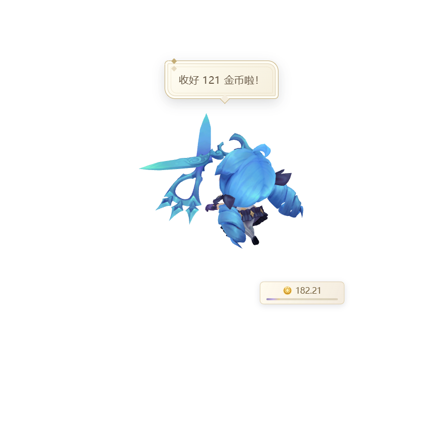
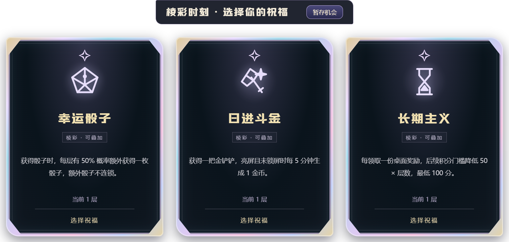
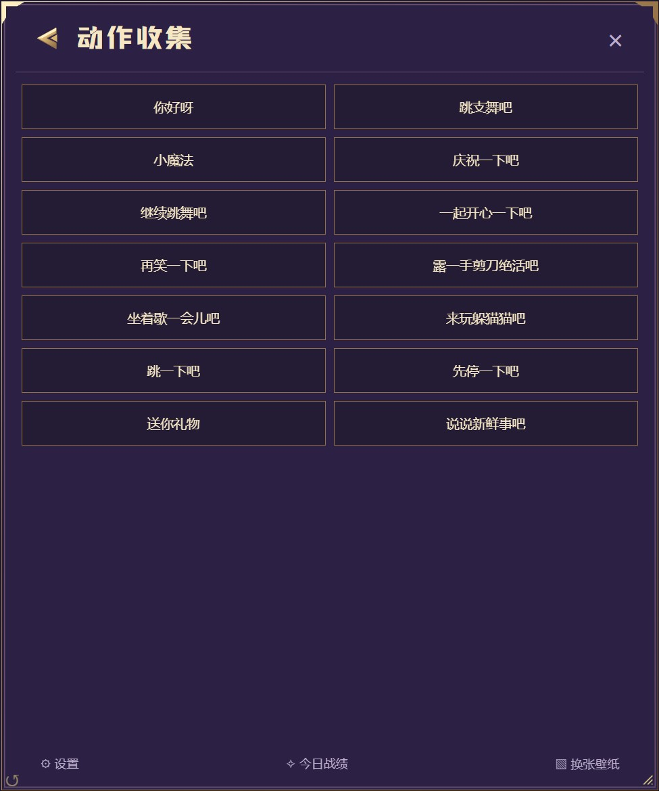

# 小小英雄

### 桌面陪伴 × 摸鱼模式 × 挂机增量

让日常点击与打字，变成桌面上的一点小惊喜。

[下载安装包](https://github.com/BingLing2001/Little_Heros/releases/latest) · [操作速查](#操作速查) · [好友串门](#好友串门) · [安装与更新](#安装与更新)

**发布准备中** · 安装包以 Releases 中实际公开的正式版本为准。

> Windows x64 桌面游戏。这个仓库用于发布安装包和玩法说明，不包含开发源码。下方图片为历史实机界面参考，数值为演示数据；按钮位置以当前客户端为准。

## 小小英雄是什么

小小英雄住在透明桌面上：你照常工作、打字和使用电脑，它陪伴你，并把日常活动积累成积分。休息时，领一份奖励、挑一张祝福，或者叫朋友来串门。

- **摸鱼模式**：通过角色右键手势或快捷键，快速唤起／收起配置好的应用与信息页；想看视频也不用离开信息页。
- **挂机增量**：日常操作 → 积分 → 桌面奖励 → 主动拾取 → 金币、骰子与海克斯祝福。不是必须一直盯着的游戏。
- **随心陪伴**：九款角色、移动与互动动作，既能自由闲逛，也能原地安静陪着你。
- **好友串门**：交换游戏 ID、邀请组队，一起看角色移动、做动作，访问朋友的游戏空间。

## 摸鱼模式

先在 **信息页 → 设置 → 应用与快捷键** 中选择你想控制的游戏或应用。

1. **短按角色右键**：打开／收起信息页。
2. **双击角色右键**：唤起／收起当前应用；信息页和应用同时显示时统一收起。
3. **按快捷键**：默认 `Ctrl + Alt + I` 控制信息页，`Ctrl + Alt + J` 控制当前应用。

开启“单次右键优先恢复当前应用”后，以你保存的设置为准。这里的“摸鱼”是快捷切换，不会让进程隐身，也不是屏幕隐私保护。

## 挂机增量

**照常用电脑积累积分，再指挥角色去领取奖励。**有效亮屏挂机也能积累；关闭程序、锁屏、休眠或离线退出不产生这类收益。

| 日常活动                   | 基础积分                        |
| -------------------------- | ------------------------------- |
| 鼠标左键／右键点击         | 每次 +1                         |
| 真实按下按键               | 每次 +2；长按自动重复不重复计分 |
| 程序运行、屏幕亮着且未锁屏 | 每分钟 +2                       |
| 鼠标累计移动一屏宽距离     | +5                              |

初始每 **1000 分**产生一份桌面奖励。右键空白处指挥角色走到奖励旁，或拖动角色到奖励旁松手，即可拾取；**自主闲逛不会替你领取**。

| 捡到什么 | 可以做什么                                                               |
| -------- | ------------------------------------------------------------------------ |
| 金币     | 基础 100 金币，祝福可影响收益                                            |
| 黄色法球 | 获得十二面骰子机会；点击暂停后随机抽取 1–12 点，基础收益为点数 × 20 金币 |
| 蓝色法球 | 随机出现三张海克斯祝福，选一张改变后续积累方式                           |

想轻松积累，就选适合自己的祝福：降低下次奖励门槛、提高金币倍率、增加骰子机会，或让有效亮屏慢慢产出金币。机会可以暂存，在 **今日战绩** 中继续使用；重开不会刷新已确定的候选和结果。骰子暂停时机及画面朝向不决定点数。

## 操作速查

| 操作                    | 效果                                                 |
| ----------------------- | ---------------------------------------------------- |
| 左键单击／双击角色      | 互动反馈                                             |
| 连续三击角色            | 查看简讯                                             |
| 左键拖动角色            | 调整位置；在奖励旁松手可拾取                         |
| 右键桌面空白处          | 指挥角色移动                                         |
| 短按／双击角色右键      | 信息页／当前应用的唤起与收起                         |
| 长按角色右键约 450 毫秒 | 打开九角色轮盘，移向头像后松手选择；`Esc` 取消       |
| `W A S D`               | 空桌面处于前台且信息页／菜单关闭时连续移动，松开即停 |
| `Ctrl + Alt + I`        | 信息页默认热键                                       |
| `Ctrl + Alt + J`        | 当前应用默认热键                                     |

快捷键可以在设置中修改。切回普通应用后，角色不再响应桌面 WASD 移动，避免妨碍打字。

想让角色跳舞，或者安静待着？

在首页使用“安静陪我”，或进入 **更多动作**，选择跳舞、玩剪刀和小魔法。有限动作结束后回到原陪伴状态；持续表演可用“先停一下吧”停止。手动指挥优先，设置中的定点陪伴不会让角色自行走开。

## 好友串门

**双方各自登录游戏，不需要交换密码。**

1. 在“好友串门”面板复制 **我的游戏 ID**，发给朋友。
2. 对方搜索完整 ID，发起好友申请；收到申请后同意。
3. 对在线玩家点 **邀请组队**，对方接受后进入邀请者的空间。
4. 一起移动、做动作，用“🌹🌹／谢谢／👋”回应。
5. 访客点 **回家**；房主点 **立即关门** 结束接待。

串门同步的是游戏角色、动作和房主的静态壁纸；正常离房、断线或退出后恢复原壁纸。**这不是远程桌面**，不会把真实应用窗口、文件或电脑控制权共享给朋友。不要使用带私人信息的接待壁纸。

云端来访金币与本地“今日战绩”的个人金币分开记录，不能直接相加；访客每天对同一房主最多拾取 3 个地面云端金币。动态壁纸和复杂多屏环境有兼容边界。

## 视频与桌面外观

信息页可搜索、观看 B站／抖音内容。输入关键词后按 `Enter`，用刷新按钮重试或换一批；需要平台登录／验证时，请在对应账号窗口自行完成。平台限制、账号状态和网络会影响可用内容，游戏账号与视频网站账号相互独立。

想换个心情，也可以调整角色大小和陪伴方式，或在 **换张壁纸** 中选择、添加自己的图片。

## 安装与更新

1. 打开 [Releases](https://github.com/BingLing2001/Little_Heros/releases)，下载最新正式版中的 **`little-heroes-版本号-x64-setup.exe`**。若尚无正式版本，请等待发布。
2. 双击安装包，按 Windows 安装提示完成。不要下载 GitHub 自动生成的 “Source code (zip)”——它不是游戏。
3. 启动后使用游戏账号登录；没有账号请联系作者获取，不要在公开 Issue 中发送密码。
4. 已安装支持在线更新的版本：在登录页“版本更新”或信息页“设置”中 **检查更新 → 安装最新版**。下载完成并校验后保存数据、退出游戏，再安装新版本。

GitHub 是主下载源，失败时使用较慢的官方备用源。检查不会自动下载安装，下载期间可以取消。更新沿用原有存档和设置，保留最近一次恢复备份；**不要先卸载游戏或删除 AppData**。早期没有更新入口的版本，需要手动安装一次支持更新的版本。

目前仅提供 **Windows x64** 安装包，不提供 macOS 版。程序可能需要 Windows 权限确认；更新签名不是 Windows 代码签名，不代表系统一定不显示提示。不要为安装游戏关闭安全防护。

完整离线说明在 **信息页 → 设置 → 玩法说明**。字体和指南随游戏提供，阅读说明不需要开发工具。

## 反馈问题

请说明游戏版本、Windows 版本、显示器数量／缩放比例，以及“做了什么 → 发生什么”。有白色蒙版、壁纸恢复或更新失败时，先彻底退出游戏，再记录复现步骤；不要删除存档或恢复目录。截图发布前遮住账号、密码、API Key 和私人桌面内容。

每次正式发布都会同步本页、版本说明与相关玩法图文。安装包与更新记录以 [Releases](https://github.com/BingLing2001/Little_Heros/releases) 为准。
